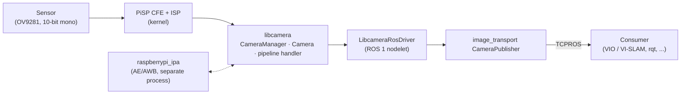
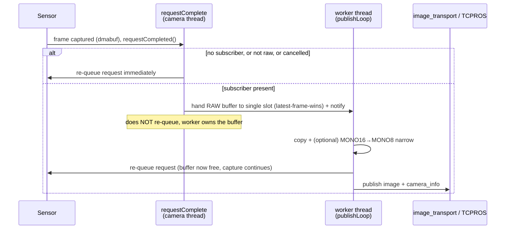
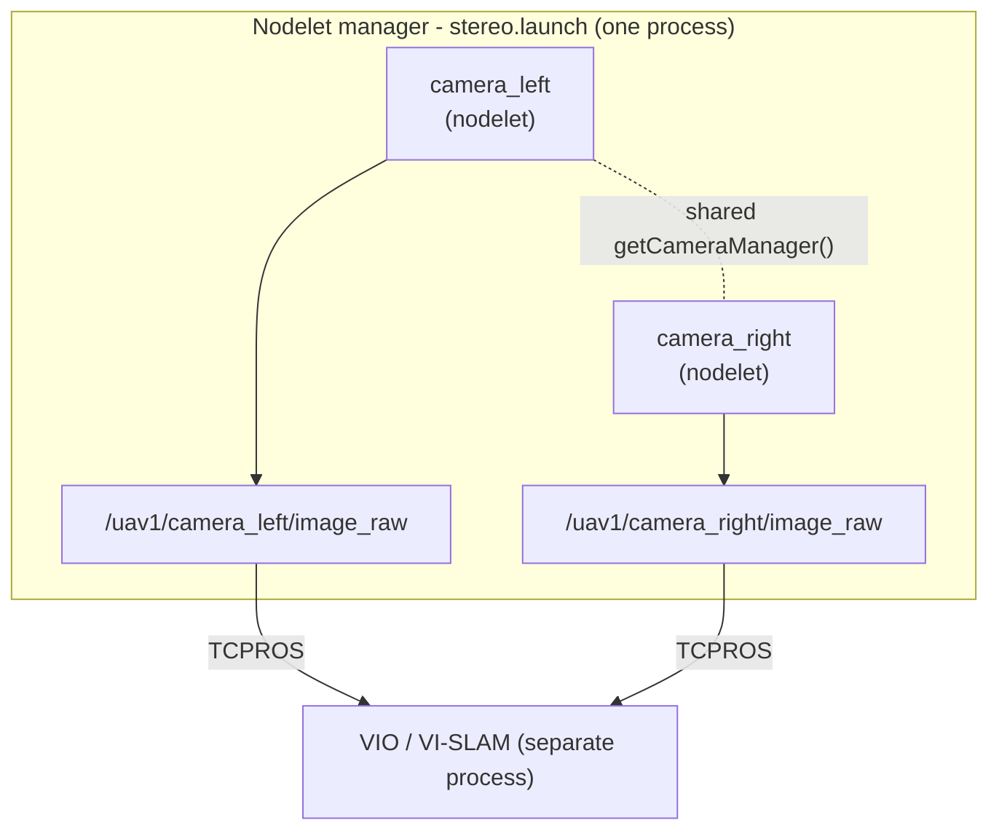

# Libcamera ROS driver

A ROS 1 (Noetic) wrapper around [libcamera](https://libcamera.org) for Raspberry Pi
cameras, tuned for **low-CPU, high-rate** streaming on a Raspberry Pi 5 (PiSP pipeline),
e.g. global-shutter mono sensors (OV9281) feeding a stereo VIO / VI-SLAM pipeline.

---

## What libcamera is

libcamera drives the Raspberry Pi camera system directly from open-source code on the Arm
cores, bypassing almost all of the proprietary Broadcom GPU code. It exposes a C++ API:
you *configure* a camera, then *request* image frames. The buffers live in system memory
(dmabuf) and are handed to the application. This package wraps that flow as a ROS 1
**nodelet** that publishes `sensor_msgs/Image` + `sensor_msgs/CameraInfo`.

---

## Architecture

### Components



- **libcamera `CameraManager`** - one per process. Owns the camera, runs the PiSP pipeline
  handler, and emits the `requestCompleted` signal **on its own thread**. The driver gets it
  through a process-wide `getCameraManager()` singleton, so several nodelets in one manager
  share a single manager (libcamera aborts on a second one in the same process).
- **`LibcameraRosDriver`** - the nodelet. Configures the stream, allocates buffers, and on
  each completed frame builds and publishes the messages.
- **IPA (`raspberrypi_ipa`)** - auto-exposure / white-balance, runs in a separate process
  and is cheap. Disabled here (`ae_enable:false`) for stable VIO exposure.

### Per-frame pipeline (threading model)

The expensive per-frame work (the pixel copy + format narrowing + serialization) is moved
**off** the libcamera camera thread onto a dedicated **worker thread**, so the camera thread
stays light and frames flow with minimal contention.



Key properties baked into this flow:

| Property | How |
|---|---|
| **Camera thread stays light** | copy/narrow/serialize run on the worker, not the camera thread |
| **No wasted work** | if `getNumSubscribers()==0`, the frame is dropped before any copy |
| **Never falls behind** | single-slot **latest-frame-wins**: a stale frame is dropped, never queued |
| **No silent death** | every request is *always* re-queued (worker, or the camera thread for dropped/error paths); a leaked buffer would silently stop the camera, so this is guarded with `try/catch` + throttled logs |
| **Half the bytes (opt-in)** | `publish_mono8` narrows the 10-bit-in-16 sensor data to MONO8 in the copy, halving payload/transport |

### Recommended deployment: single shared nodelet manager

libcamera allows **one `CameraManager` per process**. The two layouts trade off against that:

- **Single manager** (`stereo.launch`) — both cameras run as nodelets loaded into **one**
  nodelet manager, so they share the process and the `getCameraManager()` singleton (the ROS 1
  analogue of the ROS 2 component container). Measured the **better default**: same driver CPU
  as two processes but lower RAM (~33 MB vs ~52 MB) and slightly lower whole-Pi busy, plus a
  shared clock domain. The heavy per-frame work runs on a per-nodelet worker thread, so the
  shared camera-callback thread is **not** a bottleneck (see [Performance notes](#performance-notes)).
- **One process per camera** (two `camera.launch`, `standalone:=true`) — each camera gets its
  own process and CameraManager thread, so the per-camera libcamera work runs **in parallel on
  separate cores**. Pick this only if you need that core-level isolation; it costs more RAM.



Neither layout **synchronizes the two sensors' exposures** (see
[Stereo synchronization](#stereo-synchronization)) — the single manager only gives a shared
clock domain. With `use_ros_time: true` the two-process layout stamps both cameras on the same
ROS clock too, so cross-process timestamps remain comparable if you choose it for core isolation.

---

## Prerequisites

The `libcamera` library must be installed and findable by CMake:

1. Enable the MRS PPA ([instructions](https://github.com/ctu-mrs/mrs_uav_system?tab=readme-ov-file#native-installation)), the stable PPA is recommended.
2. `sudo apt install ros-noetic-libcamera`

Deb packages exist for arm64 and amd64. The driver targets **arm64 (Raspberry Pi 5)**;
amd64 is convenient for development. Built and tested against **ROS Noetic**.

---

## Running

### Single camera

```bash
roslaunch libcamera_ros_driver camera.launch camera_name:=front
# then verify:
rostopic hz /uav1/camera_front/image_raw
```

`standalone:=true` (default) runs as its own standalone nodelet. To load into an existing
nodelet manager instead: `standalone:=false manager:=/path/to/manager`.

### Stereo, two processes (per-core isolation)

Launch `camera.launch` twice, once per sensor, each with a `custom_config` selecting a
different camera:

```bash
roslaunch libcamera_ros_driver camera.launch \
  camera_name:=front custom_config:=/abs/path/camera_left.yaml
roslaunch libcamera_ros_driver camera.launch \
  camera_name:=back  custom_config:=/abs/path/camera_right.yaml
```

> You cannot acquire the **same physical camera** from two processes, each launch must
> select a distinct sensor (see selection below).

### Stereo, single nodelet manager (recommended, shared clock)

```bash
roslaunch libcamera_ros_driver stereo.launch \
  frame_id_left:=front  config_left:=/abs/path/camera_left.yaml  calib_url_left:="file:///abs/path/front_calib.yaml" \
  frame_id_right:=back   config_right:=/abs/path/camera_right.yaml calib_url_right:="file:///abs/path/back_calib.yaml"
```

Both nodelets load into the `stereo_manager` nodelet manager and share one CameraManager.

### Selecting which sensor a node uses

By index (flat keys — the nodelet reads its private params directly, **no** `libcamera_ros_driver:` prefix):

```yaml
camera_name: ""   # empty disables name matching
camera_id: 0      # 0 / 1
```

or by the unique i2c path (robust across reboots; see the `dtoverlay ...,cam0/cam1` setup
in `/boot/firmware/config.txt`):

```yaml
camera_name: "i2c@80000"   # / "i2c@88000"
```

Minimal per-camera overrides ship as `config/camera_left.yaml` / `config/camera_right.yaml`.

---

## Configuration

Parameters resolve in this order (first match wins):

```
custom_config (per-camera)  >  config/default.yaml  >  launch-file ROS params (frame_id, calib_url)
```

`custom_config` is loaded *after* `default.yaml` in the launch files, so it only needs the keys
that differ (typically the sensor selection and per-camera tweaks); everything else falls through
from `default.yaml`.

### Key parameters

| Parameter | Default | Notes |
|---|---|---|
| `stream_role` | `still` | `[raw, still, video, viewfinder]`. For the OV9281 mono sensor use **`video`**, the role that yields a node-consumable format. (`raw` exposes only packed formats this node can't decode.) |
| `pixel_format` | `RGB888` | On the OV9281 (10-bit mono) every mono request is **promoted to R16** by the pipeline, mono is treated as raw, and the sensor has no 8-bit mode. So you get MONO16 regardless. |
| `resolution/{width,height}` | `1280×800` | sensor native |
| `use_ros_time` | `true` | stamp on ROS clock (keeps cross-process stamps comparable) |
| **`publish_mono8`** | `false` | **Narrow MONO16 → MONO8 before publishing.** Halves payload, transport, and the subscriber's copy. Lossy (drops the low bits feature trackers ignore). Only acts on a mono16 source. Set `true` for 8-bit greyscale consumers like VIO. |
| **`mono8_shift`** | `8` | Bits shifted right when narrowing. PiSP packs samples **MSB-aligned**, so `8` (top byte) is correct. **Image too dark/bright → tune this** (no rebuild). Clamped to `[0,15]`. |
| **`dmabuf_sync`** | `true` | Cache invalidate/flush around the CPU read. Required for non-coherent buffers; on the Pi 5 the buffers are coherent, so `false` is safe **if the image stays clean** and saves a little CPU. |
| `control/fps` | `30` | sets `FrameDurationLimits = 1e6/fps` µs. Keep `exposure_time` below the frame period or fps silently drops. |
| `control/ae_enable` | - | **`false`** recommended for VIO / VI-SLAM (constant exposure). |
| `control/awb_enable` | - | **`false`** (pointless on a mono sensor). |
| `control/exposure_time` | - | µs, fixed when AE off. Too short → black image. |
| `control/analogue_gain` | - | fixed gain when AE off; raise if the image is dark. |

The full set of libcamera control parameters (brightness, sharpness, gains, metering, …) is
documented inline in [`config/default.yaml`](config/default.yaml).

> **Mono sensors:** colour controls (saturation, contrast, AWB, …) are simply absent on the
> OV9281. The driver skips any control the sensor doesn't expose and warns instead of crashing,
> so a config carrying colour keys is harmless on a mono camera.

---

## Stereo synchronization

Easy to get wrong, so here's what is certain versus what depends on your hardware.

**Certain:** out of the box the two sensors free-run on independent clocks. This driver does
**not** coordinate their exposures, so the left/right offset is not fixed and drifts over
time. `use_ros_time: true` (or a shared manager clock) only makes the **timestamps
comparable**, so a consumer can pair the *nearest* left/right frames, it does not change
*when* the sensors expose. As shipped, the pair is not exposure-synchronized, which is
usually insufficient for VIO / VI-SLAM.

**To synchronize them, options, most to least robust:**

1. **Hardware external trigger (recommended, standard solution).** Wire the sensors so one is
   the master (emits a frame-sync strobe, e.g. `FSIN`/`XVS`) and the other a slave that
   exposes on that trigger, this is how synchronized stereo OV9281 boards (e.g. Arducam's
   stereo HAT) work. Enabling it generally needs both the physical wiring **and** the sensor
   put into external-trigger mode via its device-tree overlay. Whether that mode is exposed
   depends on your specific camera board and kernel driver, so **check your board's docs**,
   support varies.
2. **Software phase-steering (partial, not implemented here).** Because libcamera accepts a
   per-request frame duration (`FrameDurationLimits`), one camera's frame period can be nudged
   to slowly phase-lock onto the other. This reduces drift but won't match hardware-trigger
   precision. Listed for completeness, the driver doesn't do this today.

So: don't assume software alone will fully sync them, but don't assume it's impossible on
your hardware either, the deciding factor is whether your sensor/driver exposes an
external-sync mode. **Verify empirically** with the bundled helper, which watches
`t_left − t_right`:

```bash
rosrun libcamera_ros_driver check_stereo_sync.py \
  --left  /uav1/camera_left/image_raw \
  --right /uav1/camera_right/image_raw
```

- A **tight, drift-free constant** ⇒ synchronized (the constant is a fixed phase offset).
- A value that **wanders over several ms** ⇒ free-running, i.e. not synchronized.

---

## Performance notes

For two full-resolution (1280×800) OV9281 cameras at **60 Hz** on a Pi 5, the optimized driver
does the job at **~26% whole-machine busy** (≈0.71 core of driver CPU for both cameras) — and at
**idle it goes nearly silent**, the headline win. The driver reaches that via: enough capture
buffers to avoid sensor stalls, the per-frame work moved onto a worker thread, optional MONO8
narrowing to halve the payload, a no-subscriber gate, and init-time caching of all per-frame
constants. Measure it yourself with [`scripts/measure_cpu.sh`](scripts/measure_cpu.sh)
(`measure_cpu.sh mono` / `measure_cpu.sh stereo`).

Measured on this Pi 5, 60 s averages (driver CPU = summed `%CPU` of the driver process(es),
one-core scale; whole-Pi = busy across all 4 cores):

| State | Build / layout | Driver CPU | Whole-Pi busy | RSS |
|---|---|---|---|---|
| **Streaming** (subscriber consuming) | old | 81% | 34% | 55 MB |
| | new, 2× mono | 70% | 26% | 54 MB |
| | new, stereo manager | 71% | 25% | **35 MB** |
| **Idle** (no subscribers) | old | **41%** | 13% | 54 MB |
| | new, 2× mono | **4.4%** | 4% | 52 MB |
| | new, stereo manager | **3.9%** | 3.5% | **33 MB** |

Two takeaways. **At idle** the no-subscriber gate makes the driver go nearly silent — ~4% vs
the old build's **41%**, an ~9× reduction. The old driver keeps serializing and publishing
frames into a topic nobody reads; the gate drops them before any copy. With no subscriber there
is no transport to confound it, so this is the cleanest proof of the gate. **Under load** the
new build does 60 Hz at ~13% less driver CPU and a quarter less whole-Pi busy, from the
worker-thread offload and per-frame caching.

> **Wire bytes (MONO8) not shown:** the measurement runs in this set used a local subscriber,
> so `eth0` TX read 0 throughout and isn't tabulated. The MONO8 narrowing still halves the
> serialized `sensor_msgs/Image` payload (a `mono8` frame is half a `mono16` one); to see it on
> the wire, measure with a subscriber on another machine over Ethernet.

**Stereo single-manager vs two-process mono:** driver CPU is a wash (~70% either way), but the
shared manager wins on **RAM (~33 MB vs ~52 MB)** and a touch on whole-Pi busy, *and* gives
coherent stereo timestamps (one `CameraManager` via the `getCameraManager()` singleton). The
heavy per-frame work still runs on a per-nodelet worker thread, so the shared camera-callback
thread is not a bottleneck. The single-manager layout is the better default unless you
specifically need each camera's libcamera work pinned to its own core.

The frame rate is bounded by the sensor mode / exposure and capture-buffer count, **not** by
CPU (the un-optimized build hits 60 Hz too, just at higher cost). If you need to go further on
CPU, the remaining levers are **system-level** (e.g. nodelet-aware zero-copy transport to a
co-located consumer) rather than driver code.

---

## Tests

```bash
catkin run_tests libcamera_ros_driver --no-deps && catkin_test_results build/libcamera_ros_driver
```

- `test_performance` — pure C++/gtest, no roscore: gates the copy/narrow hot path against the 60 Hz budget.
- `test_integration` — MONO16→MONO8 narrowing byte-exactness + a `rostest` image round-trip.
- `test_hw_smoke` — opt-in behind `LIBCAMERA_ROS_HW_TEST=1` (skips in CI; needs a real camera).

---

## Acknowledgements

Inspired by the ROS 2 camera driver: https://github.com/christianrauch/camera_ros.
