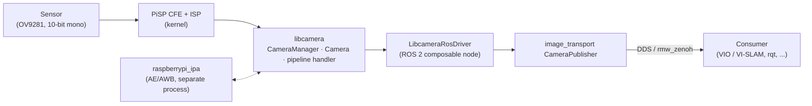
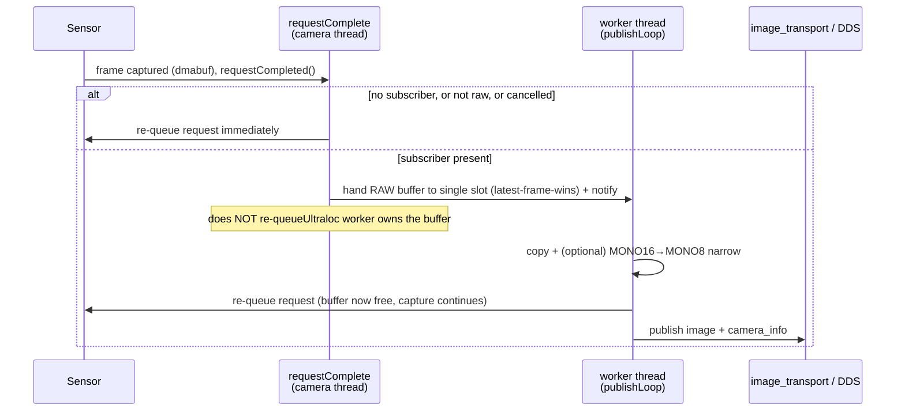
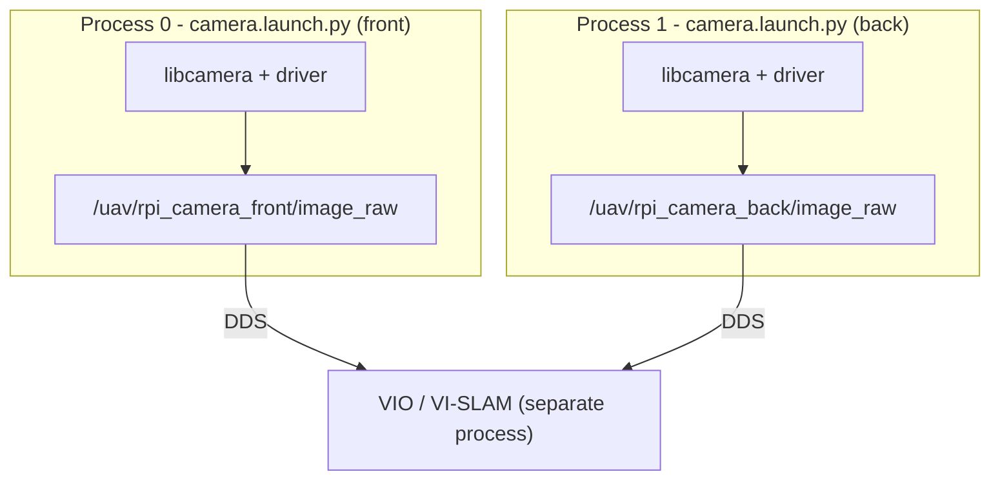

# Libcamera ROS driver

A ROS 2 (Jazzy) wrapper around [libcamera](https://libcamera.org) for Raspberry Pi
cameras, tuned for **low-CPU, high-rate** streaming on a Raspberry Pi 5 (PiSP pipeline),
e.g. global-shutter mono sensors (OV9281) feeding a stereo VIO / VI-SLAM pipeline.

Upstream libcamera fork: https://github.com/ctu-mrs/libcamera_ros/tree/ros2

---

## What libcamera is

libcamera drives the Raspberry Pi camera system directly from open-source code on the Arm
cores, bypassing almost all of the proprietary Broadcom GPU code. It exposes a C++ API:
you *configure* a camera, then *request* image frames. The buffers live in system memory
(dmabuf) and are handed to the application. This package wraps that flow as a ROS 2
composable node that publishes `sensor_msgs/Image` + `sensor_msgs/CameraInfo`.

---

## Architecture

### Components



- **libcamera `CameraManager`** - one per process. Owns the camera, runs the PiSP pipeline
  handler, and emits the `requestCompleted` signal **on its own thread**.
- **`LibcameraRosDriver`** - the ROS node. Configures the stream, allocates buffers, and on
  each completed frame builds and publishes the messages.
- **IPA (`raspberrypi_ipa`)** - auto-exposure / white-balance, runs in a separate process
  and is cheap. Disabled here (`ae_enable:false`) for stable VIO exposure.

### Per-frame pipeline (threading model)

The expensive per-frame work (the pixel copy + format narrowing + serialization) is moved
**off** the libcamera camera thread onto a dedicated **worker thread**, so the camera thread
stays light and frames flow with minimal contention.



Key properties baked into this flow:

| Property | How |
|---|---|
| **Camera thread stays light** | copy/narrow/serialize run on the worker, not the camera thread |
| **No wasted work** | if `getNumSubscribers()==0`, the frame is dropped before any copy |
| **Never falls behind** | single-slot **latest-frame-wins**: a stale frame is dropped, never queued |
| **No silent death** | every request is *always* re-queued (worker, or the camera thread for dropped/error paths); a leaked buffer would silently stop the camera, so this is guarded with `try/catch` + throttled logs |
| **Half the bytes (opt-in)** | `publish_mono8` narrows the 10-bit-in-16 sensor data to MONO8 in the copy, halving payload/transport |

### Recommended deployment: single shared container

libcamera allows **one `CameraManager` per process**. The two layouts trade off against that:

- **Single container** (`stereo.launch.py`) — both cameras in one process, sharing one
  CameraManager. Measured the **better default**: same driver CPU as two processes but lower
  RAM (~30 MB vs ~50 MB) and slightly lower whole-Pi busy, plus a shared clock domain. The
  heavy per-frame work runs on a per-node worker thread, so the shared camera-callback thread
  is **not** the bottleneck the older note assumed (see [Performance notes](#performance-notes)).
- **One process per camera** (two `camera.launch.py`) — each camera gets its own
  CameraManager thread, so the per-camera libcamera work runs **in parallel on separate
  cores**. Pick this only if you need that core-level isolation; it costs more RAM.



The two cameras share one CameraManager thread for the *capture callback*, but neither
layout **synchronizes the two sensors' exposures** (see [Stereo synchronization](#stereo-synchronization)) —
the single container only gives a shared clock domain. With `use_ros_time: true` the
two-process layout stamps both cameras on the same ROS clock too, so cross-process timestamps
remain comparable if you choose it for core isolation.

---

## Prerequisites

The `libcamera` library must be installed and findable by CMake:

1. Enable the MRS PPA ([instructions](https://github.com/ctu-mrs/mrs_uav_system/tree/ros2?tab=readme-ov-file#native-installation)), the stable PPA is recommended.
2. `sudo apt install ros-jazzy-libcamera`

Deb packages exist for arm64 and amd64. The driver targets **arm64 (Raspberry Pi 5)**;
amd64 is convenient for development. Built and tested against **ROS 2 Jazzy**.

---

## Running

### Single camera

```bash
ros2 launch libcamera_ros_driver camera.launch.py camera_name:=front
# then verify:
ros2 topic hz /uav1/rpi_camera_front/image_raw
```

`standalone:=true` (default) starts its own container. To load into an existing container
instead: `standalone:=false container_name:=/path/to/container`.

### Stereo, two processes (per-core isolation)

Launch `camera.launch.py` twice, once per sensor, each with a `custom_config` selecting a
different camera:

```bash
ros2 launch libcamera_ros_driver camera.launch.py \
  camera_name:=front custom_config:=/abs/path/camera_left.yaml
ros2 launch libcamera_ros_driver camera.launch.py \
  camera_name:=back  custom_config:=/abs/path/camera_right.yaml
```

> You cannot acquire the **same physical camera** from two processes, each launch must
> select a distinct sensor (see selection below).

### Stereo, single container (recommended, shared clock)

```bash
ros2 launch libcamera_ros_driver stereo.launch.py \
  left_name:=front  left_custom_config:=/abs/path/camera_left.yaml  left_calib_url:="file:///abs/path/front_calib.yaml" \
  right_name:=back  right_custom_config:=/abs/path/camera_right.yaml right_calib_url:="file:///abs/path/back_calib.yaml"
```

### Selecting which sensor a node uses

By index:

```yaml
libcamera_ros_driver:
  camera_name: ""   # empty disables name matching
  camera_id: 0      # 0 / 1
```

or by the unique i2c path (robust across reboots; see the `dtoverlay ...,cam0/cam1` setup
in `/boot/firmware/config.txt`):

```yaml
libcamera_ros_driver:
  camera_name: "i2c@80000"   # / "i2c@88000"
```

Minimal per-camera overrides ship as `config/camera_left.yaml` / `config/camera_right.yaml`.

---

## Configuration

Parameters resolve in this order (first match wins):

```
custom_config (per-camera)  >  config/default.yaml  >  launch-file ROS params (frame_id, calib_url)
```

`custom_config` is loaded *before* `default.yaml`, so it only needs the keys that differ
(typically the sensor selection and per-camera tweaks); everything else falls through.

### Key parameters

| Parameter | Default | Notes |
|---|---|---|
| `stream_role` | `video` | `[raw, still, video, viewfinder]`. Use **`video`**, it's the role that yields a node-consumable format on this sensor. (`raw` exposes only packed formats this node can't decode.) |
| `pixel_format` | `R8` | On the OV9281 (10-bit mono) every mono request is **promoted to R16** by the pipeline, mono is treated as raw, and the sensor has no 8-bit mode. So you get MONO16 regardless. |
| `resolution/{width,height}` | `1280×800` | sensor native |
| `use_ros_time` | `true` | stamp on ROS clock (keeps cross-process stamps comparable) |
| **`publish_mono8`** | `true` | **Narrow MONO16 → MONO8 before publishing.** Halves payload, transport, and the subscriber's copy. Lossy (drops the low bits feature trackers ignore). Only acts on a mono16 source. |
| **`mono8_shift`** | `8` | Bits shifted right when narrowing. PiSP packs samples **MSB-aligned**, so `8` (top byte) is correct. **Image too dark/bright → tune this** (no rebuild). Clamped to `[0,15]`. |
| **`dmabuf_sync`** | `true` | Cache invalidate/flush around the CPU read. Required for non-coherent buffers; on the Pi 5 the buffers are coherent, so `false` is safe **if the image stays clean** and saves a little CPU. |
| `control/fps` | `60` | sets `FrameDurationLimits = 1e6/fps` µs. Keep `exposure_time` below the frame period or fps silently drops. |
| `control/ae_enable` | - | **`false`** recommended for VIO / VI-SLAM (constant exposure). |
| `control/awb_enable` | - | **`false`** (pointless on a mono sensor). |
| `control/exposure_time` | - | µs, fixed when AE off. Too short → black image. |
| `control/analogue_gain` | - | fixed gain when AE off; raise if the image is dark. |

The full set of libcamera control parameters (brightness, sharpness, gains, metering, …) is
documented inline in [`config/default.yaml`](config/default.yaml).

---

## Stereo synchronization

Easy to get wrong, so here's what is certain versus what depends on your hardware.

**Certain:** out of the box the two sensors free-run on independent clocks. This driver does
**not** coordinate their exposures, so the left/right offset is not fixed and drifts over
time. `use_ros_time: true` (or a shared container clock) only makes the **timestamps
comparable**, so a consumer can pair the *nearest* left/right frames, it does not change
*when* the sensors expose. As shipped, the pair is not exposure-synchronized, which is
usually insufficient for VIO / VI-SLAM.

**To synchronize them, options, most to least robust:**

1. **Hardware external trigger (recommended, standard solution).** Wire the sensors so one is
   the master (emits a frame-sync strobe, e.g. `FSIN`/`XVS`) and the other a slave that
   exposes on that trigger, this is how synchronized stereo OV9281 boards (e.g. Arducam's
   stereo HAT) work. Enabling it generally needs both the physical wiring **and** the sensor
   put into external-trigger mode via its device-tree overlay. Whether that mode is exposed
   depends on your specific camera board and kernel driver, so **check your board's docs**,
   support varies.
2. **Software phase-steering (partial, not implemented here).** Because libcamera accepts a
   per-request frame duration (`FrameDurationLimits`), one camera's frame period can be nudged
   to slowly phase-lock onto the other. This reduces drift but won't match hardware-trigger
   precision. Listed for completeness, the driver doesn't do this today.

So: don't assume software alone will fully sync them, but don't assume it's impossible on
your hardware either, the deciding factor is whether your sensor/driver exposes an
external-sync mode. **Verify empirically** with the bundled helper, which watches
`t_left − t_right`:

```bash
ros2 run libcamera_ros_driver check_stereo_sync.py \
  --left  /uav1/rpi_camera_front/image_raw \
  --right /uav1/rpi_camera_back/image_raw
```

- A **tight, drift-free constant** ⇒ synchronized (the constant is a fixed phase offset).
- A value that **wanders over several ms** ⇒ free-running, i.e. not synchronized.

---

## Performance notes

For two full-resolution (1280×800) OV9281 cameras at the **60 Hz** target on a Pi 5, expect
**~28% whole-machine busy** (≈0.74 core of driver CPU for both cameras) — roughly **half**
the CPU of the un-optimized driver at the same rate. The driver reaches that point via: enough
capture buffers to avoid sensor stalls, the per-frame work moved onto a worker thread, MONO8
narrowing to halve the payload, a no-subscriber gate, and init-time caching of all
per-frame constants. Measure it yourself with [`scripts/measure_cpu.sh`](scripts/measure_cpu.sh).

Measured on a Pi 5, 60 s averages (driver CPU = summed `%CPU` of the driver process(es),
one-core scale; whole-Pi = idle-subtracted busy across all 4 cores):

| State | Build / layout | Driver CPU | Whole-Pi busy | eth0 TX peak | RSS |
|---|---|---|---|---|---|
| **Streaming** (rosbag + rviz over Ethernet) | old | 113% | 52% | 92 MB/s | 53 MB |
| | new, 2× mono | 74% | 28% | 43 MB/s | 51 MB |
| | new, stereo container | 74% | 27% | 37 MB/s | **30 MB** |
| **Idle** (no subscribers) | old | **47%** | 13% | 0 | 49 MB |
| | new, 2× mono | **3.3%** | 4% | 0 | 49 MB |
| | new, stereo container | **2.6%** | 2.5% | 0 | **30 MB** |

Two takeaways. **Under load** the new build does 60 Hz at half the CPU and half the wire
bytes (the MONO8 narrowing shows up as the halved eth0 peak). **At idle** the no-subscriber
gate makes the driver go nearly silent — ~3% vs the old build's **47%**, which keeps
serializing and publishing frames into a topic nobody reads. That ~18× idle reduction is the
cleanest proof of the gate, since with no subscriber there is no transport to confound it.

**Stereo single-container vs two-process mono:** driver CPU is a wash (~74% either way), but
the shared container wins on **RAM (~30 MB vs ~50 MB)** and a touch on whole-Pi busy, *and*
gives coherent stereo timestamps (one `CameraManager`). The heavy per-frame work still runs
on a per-node worker thread, so the shared camera-callback thread is not a bottleneck here.
The single-container layout is the better default unless you specifically need each camera's
libcamera work pinned to its own core.

The frame rate is bounded by the sensor mode / exposure and capture-buffer count, **not** by
CPU (the un-optimized build hits 60 Hz too, just at twice the cost). If you need to go further
on CPU, the remaining levers are **system-level** (zenoh shared-memory transport to cut the
DDS copy for a co-located consumer) rather than driver code.

---

## Acknowledgements

Inspired by the ROS 2 camera driver: https://github.com/christianrauch/camera_ros.
